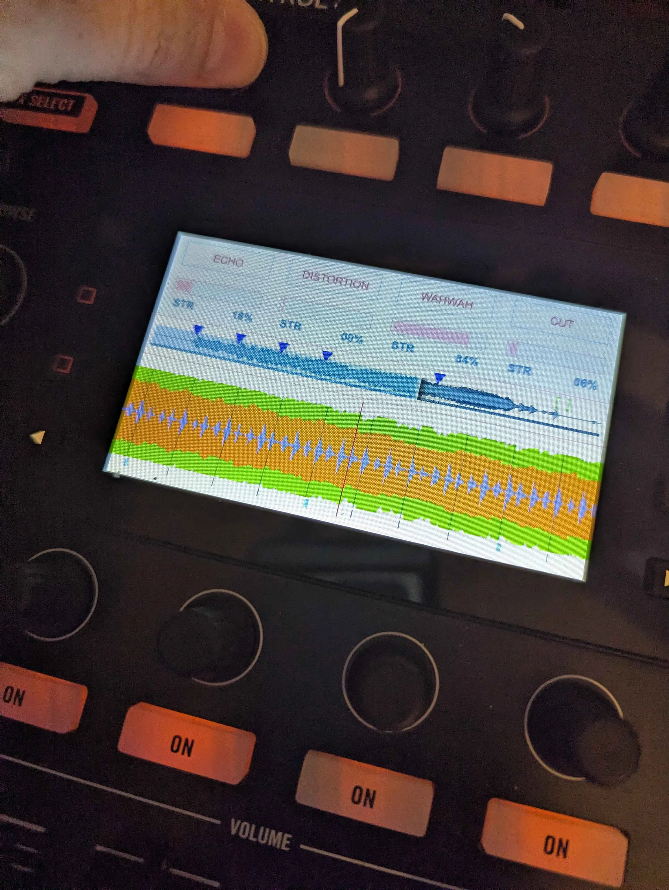

# Trans Pride — Kontrol S8 Screens

A VirtualDJ skin for the Traktor Kontrol S8's two built-in screens, recolored in the trans pride flag palette (light blue, pink, white). It replaces the stock deck/browser display shown on the hardware screens — it does **not** change the S8's mixer/jog LEDs or the main VirtualDJ GUI on your computer monitor.

## Screenshots
Photos of the skin running on real S8 hardware:

| Main deck view | FX faders | Browser |
| --- | --- | --- |
|  |  |  |

## Requirements
- VirtualDJ with support for skin format v830+ (recent VirtualDJ 2023/8 builds).
- A Traktor Kontrol S8, mapped in VirtualDJ.
- 4-deck mode — the skin is built for `nbdecks="4"` (two decks per side, A/C on the left screen, B/D on the right).

## Installation
1. Download `Traktor Kontrol S8 Screens.zip`.
2. Copy zip file into your VirtualDJ `Skins` folder
  - macOS: `~/Library/Application Support/VirtualDJ/Skins/`
  - Windows: `Documents/VirtualDJ/Skins/`

## Color theme
- Deck A / C (odd decks) are tinted trans-flag **blue** (`#5bcefa`); Deck B / D (even decks) are tinted **pink** (`#f5a9b8`).
- Each deck's panel background cycles blue → pink → white → pink across decks 1–4, echoing the flag's stripe order.
- Track titles, artist names, and remix/featuring credits are split into separate colors (blue for title/artist, pink/red for remix/featuring) so they stay readable at a glance.
- Musical key and star-rating text are tinted with VirtualDJ's own key/rating color, not the theme, so they still convey information at a glance.

## Deck view (per screen)
- Album art cover, scrolling title/artist text (remix and "featuring" credits shown in a distinct color from the main title/artist).
- Precise BPM, elapsed time, and current musical key (color-coded by key).
- Current loop size readout, toggled from the loop button on the controller.
- Loaded track's star rating, shown as a single digit tinted with the track's color tag (same source as the browser's rating column).
- Full-height scrolling waveform with:
  - Stem-style coloring (vocal / instrumental / beat) when stem separation data is available.
  - Beat grid ticks and cue point markers with labels.
  - A fixed center playhead needle.
- A compact overview waveform (`songpos`) with colored cue and loop markers.
- Two waveform density modes (full-size vs. compact), switchable via the skin's `$deckview` variable, which also toggles a secondary display for the other deck loaded on that side.

## Dual-deck screen sharing
Each physical screen is shared by two decks (left screen: decks 1 & 3; right screen: decks 2 & 4). Whichever deck is currently assigned to that side of the controller gets the full deck view; the other deck (if loaded) can be shown as a slim strip above it with its own title/BPM/time and mini waveform.

## FX faders
These views are switched from the hardware buttons/knobs beneath each screen, not by touching the display. Triggering the FX fader control swaps the deck info panel for four horizontal effect-parameter faders (one per active FX slot), each showing the parameter name and live value, with a "from middle" bipolar fader style. A shift layer swaps to each effect's second parameter. The panel fades back out automatically after use.

## FX slot browser
A dedicated full-screen mode per FX slot lists the surrounding effect names (several before/after the current selection) so you can scroll and pick a new effect for that slot without leaving the screen, with the active slot's column highlighted.

## Sampler panels
- **Sampler groups:** four volume faders with group name and percentage, for the sampler's mixer groups.
- **Sampler FX:** four effect-parameter faders for the sampler's effect slot, plus an on/off toggle and effect name.
Both are toggled from a hardware button and fade out after use, matching the FX fader behavior.

## Pop-up BPM / Key / Loop panels
- **BPM view:** large centered BPM readout with on-screen hints for resetting/smoothing tempo from the controller.
- **Key view:** large key display, a MATCH button, key-shift modifier readout, and hints for resetting/matching key.
- **Loop view:** a large circular loop-size button.
- A small on-screen options strip (BPM / KEY / − / +) is available for adjusting these without hunting for hardware controls.

## Browser
- Custom-drawn track list (not the stock control) with alternating blue/pink row stripes and a highlighted selected row, so it matches the theme instead of the hardware default.
- Columns: rating (as a colored star/digit), album art thumbnail, artist, title, BPM, and key (key-colored).
- Already-played tracks are dimmed grey.
- Column headers (ARTIST / TITLE / BPM / KEY) show the current sort direction; while the browser is open, pressing the hardware button beneath the corresponding column sorts by it.
- Header bar shows the current folder/list name and total file count.
- Custom scrollbar reflecting position in a long list.
- Custom-drawn **folder/tree browser** (separate from the track list) with up to 10 levels of visual indentation, alternating stripes, and selection highlighting — built from scratch because the stock folder-list control ignores skin colors on real S8 hardware.

## Notes for mappers
This skin's alternate views (touch FX faders, FX slot browser, sampler panels, BPM/Key/Loop pop-ups, and browser mode) are driven by custom skin variables (e.g. `s8fxtouch`, `s8fxselect`, `s8samgroup`, `s8samfx`, `s8bpmview`, `s8loopselect`, `s8browser`, `$deckview`, `screenoptions`). Your VirtualDJ mapping needs to toggle/set these variables from controller buttons for those views to be reachable — they won't appear on their own.

## Credits
Based on Atomix Productions' stock Traktor Kontrol S8 Screens skin (VirtualDJ), recolored and reworked for the trans pride theme.
